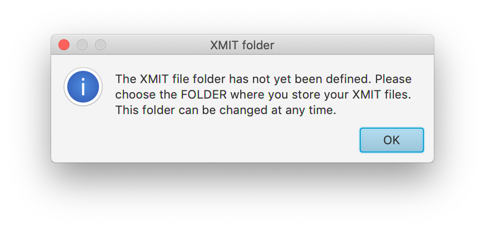
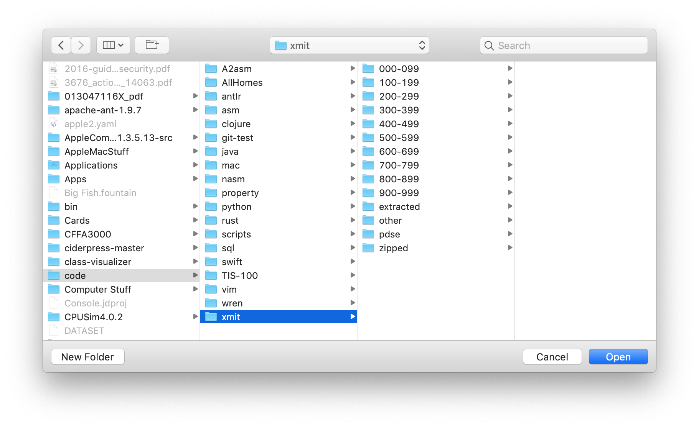

# Xmit
- view the contents of xmit files
- view xmit files [stored as PDS members](resources/embedded.md)
- view [compressed xmit files](resources/compressed.md)
- extract [individual PDS members](resources/extract.md)
- selectable codepages

## Sample screens
### MacOS

### Windows

### Linux


## Installation
- Download and install [Java 11](https://jdk.java.net/11/) and [JavaFX 11](https://gluonhq.com/products/javafx/), which are now separate downloads.
- Download [XmitApp](https://github.com/dmolony/xmit/releases).
- Create executable run file.  
#### MacOS or Unix shell file  

```
/path/to/jdk-11.0.1.jdk/Contents/Home/bin/java    \
--module-path /path/to/javafx-sdk-11/lib          \
--add-modules=javafx.controls                     \
-Dfile.encoding=UTF-8                             \
-jar /path/to/XmitApp.jar
```  
#### Windows batch file  

```
C:\path\to\jdk-11.0.1\bin\java.exe                \
--module-path C:\path\to\javafx-sdk-11.0.1\lib    \
--add-modules=javafx.controls                     \
-Dfile.encoding=UTF-8                             \
-jar C:\path\to\XmitApp.jar
```
### First execution
Read the helpful message.  
  
Specify the location of your xmit files. Note that this must be a FOLDER, not a file.  
  
This will remain the xmit file folder until you change it.  
