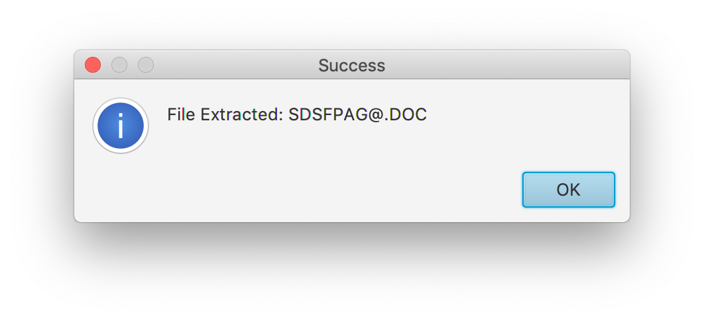

### Extract PDS member
Any member can be extracted and saved as a local file. Members with recognised signatures will default to the associated suffix.
  
After the file is extracted a confirmation message will be shown.  
  