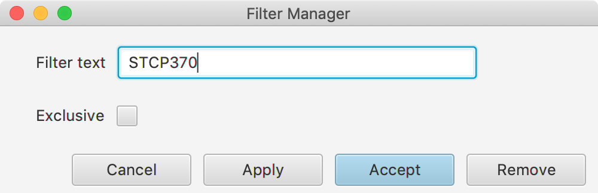

### Filter
Use the filter function (View->Set PDS Filter...) to perform a search of each PDS member for a text value.  
  
Specify the text for filtering. Check the exclusive box to only show lines that contain the text.  
  
The display changes to only show the PDS members that contain the text. Additionally, the formatting of the Output Pane changes so that only the specified text is highlighted.  
  
Toggle the filter on and off using the F key. The formatting changes back to the usual JCL highlighting.  
  
To toggle the exclusive line display, use Option-Cmd-F.  
  
