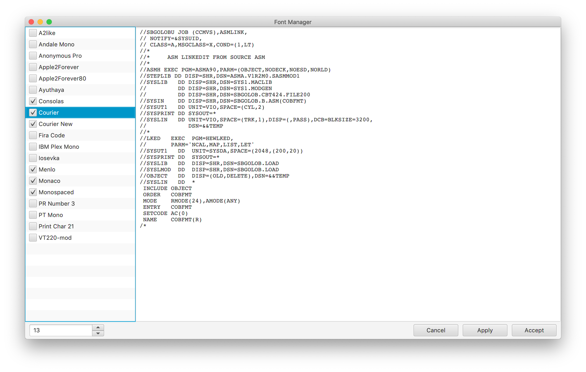

### Fonts
The Font Manager displays a list of all the monospaced fonts on your system. From this set you should select a subset of fonts that you wish to be able to choose from. Initially the subset consists of just the Monospaced font.
  
Once a subset has been created you can cycle through that list by using the comma and period keys on the main screen. Font size can be altered with the < and > keys (shift-comma and shift-period).