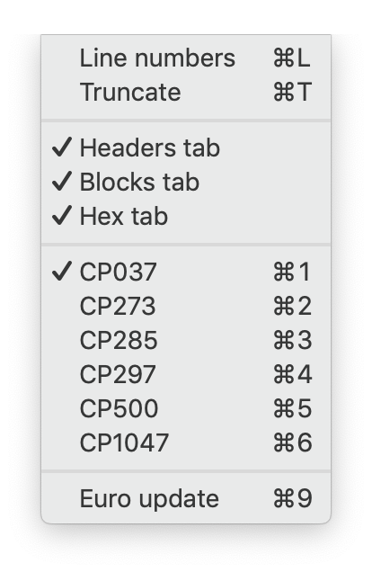

### View menu
Code pages may be selected at any time. The contents of the Output Panel will be updated whenever the selection changes. Note that PDS member names will not change, they keep the same character set that was selected when they were first read from the file.   
  
Each code page (except CP1047) has a corresponding version that includes the Euro symbol.  
  
Line numbers can be toggled on and off at any time, and the output can be also be truncated (first character on each line suppressed) if required.
